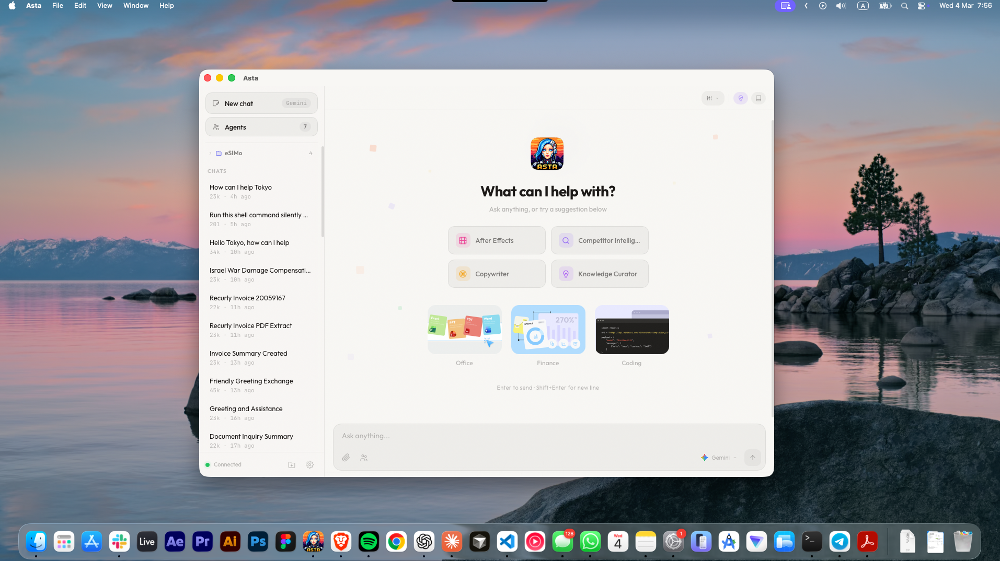

# Asta

A personal AI workspace that runs on **web**, **Telegram**, and **WhatsApp** with one shared context.

## Preview



## Why Asta

- Multi-provider AI: Groq, Google Gemini, Claude, OpenAI, OpenRouter, and Ollama.
- OpenClaw-style skill flow: model selects the best workspace skill and reads its `SKILL.md` on demand.
- Built-in skills: time/weather, web search, lyrics, Spotify, reminders, audio notes, and background learning.
- Unified memory: chat history, allowed local files, learned knowledge (RAG), and channel history.
- Native setup: no Docker required.

## Requirements

- **Backend:** Python 3.12 or 3.13 (see `backend/requirements.txt`). Python 3.14 is not yet supported (pydantic/ChromaDB).
- **Frontend:** Node 18+ (npm or pnpm).
- **Optional:** Ollama for local AI and RAG embeddings (`ollama pull nomic-embed-text`).

## Quick Start

### 1. Clone and configure

```bash
git clone https://github.com/helloworldxdwastaken/asta.git
cd asta
cp .env.example backend/.env
```

Add API keys in `backend/.env` if needed.

### 2. Start with the control script (recommended)

Backend uses **Python 3.12 or 3.13** (auto-picked; 3.14 not supported). On first run, the script creates a venv and installs deps.

```bash
./asta.sh setup     # optional: create backend venv + frontend deps first
./asta.sh install   # optional: add 'asta' command to your path
asta start          # or: ./asta.sh start
```

Open:

- Panel: `http://localhost:5173`
- API docs: `http://localhost:8010/docs`

### 3. Manual start (alternative)

Backend needs **Python 3.12 or 3.13** (3.14 not yet supported by pydantic/ChromaDB). If you only have 3.14: `brew install python@3.12`.

```bash
# Backend
cd backend
python3.12 -m venv .venv   # or python3.13 -m venv .venv
source .venv/bin/activate
pip install -r requirements.txt
uvicorn app.main:app --host 0.0.0.0 --port 8010

# Frontend (new terminal)
cd frontend
npm install
npm run dev
```

If the panel shows "API off", start the backend first or use **Settings -> Run the API**.

## `asta.sh` Commands

| Command | Description |
| --- | --- |
| `./asta.sh start` | Start backend + frontend (frees ports `8010` and `5173` first) |
| `./asta.sh stop` | Stop both services |
| `./asta.sh restart` | Restart both services |
| `./asta.sh status` | Show backend/frontend process status |

## Core Features

- **Dashboard**: system overview — Brain (AI providers), Body (CPU/RAM/disk + model), Eyes (vision), Channels, Tasks, Schedule (cron), Capabilities (skills count).
- **Chat**: provider routing + automatic skill execution.
- **Tool-first execution**: structured tools for exec/files/reminders/cron plus OpenClaw-style `process` background session management for long-running commands.
- **Files**: local knowledge files + allowed paths. User context (who you are) lives in **workspace/USER.md**.
- **Learning**: "learn about X for Y minutes" with retrievable context.
- **Cron**: list, add, update, and remove recurring jobs (e.g. daily auto-updater). Settings → Auto-updater for schedule.
- **Audio Notes**: upload/voice transcription and summary (faster-whisper).
- **Channels**: Telegram + WhatsApp integrations in one place.
- **Settings/Skills**: key management, default model, toggles, and backend controls.

## Channel Setup

- Telegram: set `TELEGRAM_BOT_TOKEN` in `backend/.env` or configure it in **Channels**.
- WhatsApp: run `services/whatsapp` (see `services/whatsapp/README.md`), scan QR in **Channels**, and set `ASTA_WHATSAPP_BRIDGE_URL`.

## Learning / RAG Setup

For learning, embeddings are required. Asta tries providers in this order: **Ollama -> OpenAI -> Google**.

```bash
./scripts/setup_ollama_rag.sh
./scripts/setup_ollama_rag.sh -i
```

Then run `ollama serve` (or open Ollama app). If Ollama is not used, set OpenAI or Gemini keys in Settings.

## Docs

- `docs/INSTALL.md`: full install and environment setup (Linux/macOS/Windows).
- `docs/ERRORS.md`: common issues and fixes.
- `docs/SPEC.md`: product behavior and implementation notes.
- `docs/SECURITY.md`: secret handling and security guidance.

## Project Structure

```text
asta/
├── backend/           # FastAPI backend
├── frontend/          # React + Vite web panel
├── services/whatsapp/ # WhatsApp bridge (Node)
├── scripts/           # helper scripts (RAG/Ollama setup)
├── docs/              # install, spec, errors, security
├── asta.sh            # start/stop/restart/status
├── .env.example       # copy to backend/.env
├── preview.png        # README preview image
└── README.md
```

## License

Use and modify freely.
