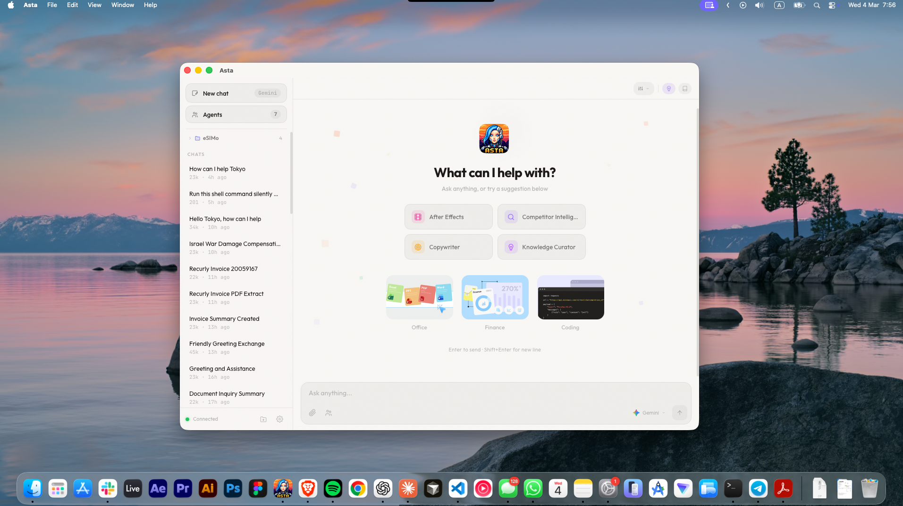

# Asta

Your own AI workspace — one backend, every screen. Asta lets you bring your own API keys (Claude, Gemini, OpenAI, Groq, OpenRouter, Ollama), wire up skills that the model picks automatically, and talk to the same persistent context from a desktop app, a mobile app, or Telegram. Think of it as a self-hosted alternative to ChatGPT that you fully control: your keys, your data, your automations. Current version: **v1.4.7**.

## Preview



## Features

- **Cross-platform** — Tauri desktop app (macOS + Windows), Expo mobile app (iOS + Android), and Telegram bot, all sharing one backend.
- **Multi-provider AI** — Groq, Google Gemini, Claude, OpenAI, OpenRouter, and Ollama with automatic fallback chain.
- **Multi-user auth** — JWT login with admin/user roles, self-registration, per-user memories, and role-based access control.
- **Skills** — the model selects the best workspace skill on demand. Built-in: web search, Spotify, reminders, document generation (PDF/DOCX/PPTX/XLSX), Google Workspace, and more. Drop a `SKILL.md` file to add your own.
- **YouTube Automation** — end-to-end video pipeline: trend discovery, footage sourcing, AI scripting, FFmpeg editing, and YouTube upload. Schedule recurring content from the Automations Dashboard.
- **Learning / RAG** — "learn about X for Y minutes" with retrievable context powered by Ollama embeddings.
- **Auto-updater** — GitHub Actions builds macOS DMG and Windows MSI on version tags; the desktop app self-updates.
- **No Docker required** — native setup with a single control script.

## Requirements

- **Backend:** Python 3.12 or 3.13 (see `backend/requirements.txt`). Python 3.14 is not yet supported (pydantic/ChromaDB).
- **Desktop App:** Node 18+ and Rust toolchain (for Tauri).
- **Optional:** Ollama for local AI and RAG embeddings (`ollama pull nomic-embed-text`).

## Quick Start

### 1. Clone and configure

```bash
git clone https://github.com/helloworldxdwastaken/asta.git
cd asta
cp .env.example backend/.env
```

Add API keys in `backend/.env` if needed.

### 2. Start with the control script (recommended)

Backend uses **Python 3.12 or 3.13** (auto-picked; 3.14 not supported). On first run, the script creates a venv and installs deps.

```bash
./asta.sh setup     # optional: create backend venv + frontend deps first
./asta.sh install   # optional: add 'asta' command to your path
asta start          # or: ./asta.sh start
```

Open:

- API docs: `http://localhost:8010/docs`

### 3. Manual start (alternative)

Backend needs **Python 3.12 or 3.13** (3.14 not yet supported by pydantic/ChromaDB). If you only have 3.14: `brew install python@3.12`.

```bash
# Backend
cd backend
python3.12 -m venv .venv   # or python3.13 -m venv .venv
source .venv/bin/activate
pip install -r requirements.txt
uvicorn app.main:app --host 0.0.0.0 --port 8010
```

If the panel shows "API off", start the backend first or use **Settings -> Run the API**.

## `asta.sh` Commands

| Command | Description |
| --- | --- |
| `./asta.sh start` | Start backend (frees port `8010` first) |
| `./asta.sh stop` | Stop backend |
| `./asta.sh restart` | Restart backend |
| `./asta.sh status` | Show backend process status |
| `./asta.sh doc` | Run safe diagnostics (setup + service checks) |
| `./asta.sh doc --fix` | Run diagnostics + auto-fix common setup/dependency issues |

## More Details

<details>
<summary>Desktop app</summary>

- Sidebar with persistent conversation history
- Agent picker with category-based colored icons
- Automations Dashboard (cron control panel) — schedule recurring jobs, YouTube Growth presets
- Document generation (PDF, DOCX, PPTX, XLSX) with in-chat download
- Reasoning controls: per-user thinking level and visibility (streamed or post-generation)
- Vision: drag-and-drop image input with hybrid vision pipeline
- Image generation via Gemini (Hugging Face FLUX.1-dev fallback)
- Tailscale remote access toggle
- Global shortcut `Alt+Space` to show/hide
- Auto-updater via GitHub Releases

</details>

<details>
<summary>Chat and AI</summary>

- SSE live streaming with real-time reasoning and assistant updates
- Provider priority chain: Claude -> Google -> OpenRouter -> Ollama (auto-disable on auth failures)
- Editable past user turns that rewind and re-run from the edit point
- Subagent orchestration: spawn, list, send, stop background sessions
- Configurable thinking level (`off` through `xhigh`) and strict final mode

</details>

<details>
<summary>Channels and integrations</summary>

- **Telegram**: bot commands (`/status`, `/exec_mode`, `/allow`, `/think`, `/subagents`), photo vision input, native media replies
- **Voice calls (Pingram)**: phone call reminders via NotificationAPI with custom templates
- **Reminders and cron**: one-shot and recurring jobs, visible in the Automations Dashboard

</details>

## Channel Setup

- Telegram: set `TELEGRAM_BOT_TOKEN` in `backend/.env` or configure it in **Channels**.
- Telegram bot commands: `/status`, `/exec_mode`, `/allow`, `/allowlist`, `/approvals` (inline `Once/Always/Deny` actions, with automatic post-approval continuation), `/think` (aliases: `/thinking`, `/t`), `/reasoning`, `/subagents`.
- Telegram markdown image replies (``) are sent as native media (photos/animations), including inline `data:image/...` payloads from image generation.
- Exec allowlist hardening: in `allowlist` mode, Asta accepts only a single direct command (no `|`, `&&`, `;`, redirects, command substitution, or multiline scripts), and blocks shell launchers (`bash`, `sh`, `zsh`, `pwsh`, `cmd`) even if manually allowlisted.
- Vision input is supported on **Telegram photos** and **desktop app** (drag-and-drop or attach button).
- Optional debugging: set `ASTA_SHOW_TOOL_TRACE=true` and `ASTA_TOOL_TRACE_CHANNELS=web` to append `Tools used: ...` on replies (Telegram footer is suppressed because it already shows proactive skill-status pings).

## Learning / RAG Setup

For learning, embeddings are required. Asta currently uses **Ollama** embeddings (`nomic-embed-text`).

```bash
./scripts/setup_ollama_rag.sh
./scripts/setup_ollama_rag.sh -i
```

Then run `ollama serve` (or open Ollama app). If Ollama is unavailable, learning/RAG endpoints are unavailable until it is running.

## Docs

- `docs/INSTALL.md`: full install and environment setup (Linux/macOS/Windows).
- `docs/ERRORS.md`: common issues and fixes.
- `docs/SPEC.md`: product behavior and implementation notes.
- `docs/SECURITY.md`: secret handling and security guidance.

## Desktop App

The desktop app lives in `MACWinApp/asta-app/` — **Tauri v2** (Rust + React/TypeScript).

**Releasing:**
```bash
# Bump version in VERSION, Cargo.toml, and tauri.conf.json, then:
git tag v1.4.7
git push origin main --tags
```
GitHub Actions automatically builds macOS DMG (Apple Silicon + Intel) and Windows MSI, then publishes them to [GitHub Releases](https://github.com/helloworldxdwastaken/asta/releases). The `latest.json` updater manifest is included in the release for the auto-updater.

**Build:**
```bash
cd MACWinApp/asta-app
npm install
npx tauri build   # outputs DMG (macOS) or MSI (Windows)
```

**Dev:**
```bash
cd MACWinApp/asta-app
npm install
npx tauri dev
```

## Mobile App

The mobile app lives in `MobileApp/` — **Expo SDK 55** (React Native + TypeScript), full feature parity with desktop.

**Dev:**
```bash
cd MobileApp
npm install
npx expo start    # scan QR with Expo Go for quick preview
```

**API base:** Points to your backend URL (configurable in Settings → Connection).

## Project Structure

```text
asta/
├── backend/           # FastAPI backend
├── MACWinApp/         # Cross-platform desktop app (Tauri + React/TypeScript)
│   └── asta-app/      # Tauri app source
│       ├── src/       # React frontend
│       └── src-tauri/ # Rust backend (Tauri commands)
├── MobileApp/         # iOS/Android mobile app (Expo SDK 55 + React Native)
│   ├── src/
│   │   ├── components/ # Drawer, Icons, ProviderIcon, Toggle, …
│   │   ├── screens/    # ChatScreen, SettingsScreen, …
│   │   └── lib/        # api.ts, auth helpers
│   └── assets/         # Provider logos, fonts
├── workspace/
│   ├── skills/        # SKILL.md workspace skills (incl. youtube-* pipeline skills)
│   ├── scripts/youtube/ # pipeline.py and video editing helpers
│   ├── youtube/       # Pipeline output videos (dated folders)
│   └── office_docs/   # Generated PDF/DOCX/PPTX/XLSX files
├── scripts/           # helper scripts (RAG/Ollama setup)
├── docs/              # install, spec, errors, security
├── asta.sh            # start/stop/restart/status/doc
├── .env.example       # copy to backend/.env
├── preview.png        # README preview image
└── README.md
```

## Contributing

Contributions are welcome. Open an issue to discuss larger changes before submitting a PR.

## License

[PolyForm Noncommercial 1.0.0](LICENSE) — free for personal and noncommercial use.
